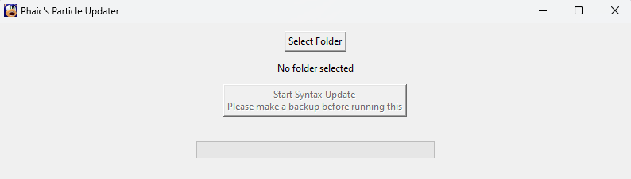

  

# Particle Syntax Updater
Automatically updates particle syntax from 24w09a to work in 1.20.5 Pre Release 1 or later

Does not include support for pre 24w09a syntax. It should work properly even still as long as your project doesn't include: `particle minecraft:item item_name{CustomModelData:1}` or `particle minecraft:entity_effect`

## How to Use
1. Download & run `particle_updater.exe` from releases
2. Select the datapack folder that you want to update
3. Click Start Syntax Update

### Discord
Consider joining my Discord

https://discord.gg/9ZRHTtu9zs
